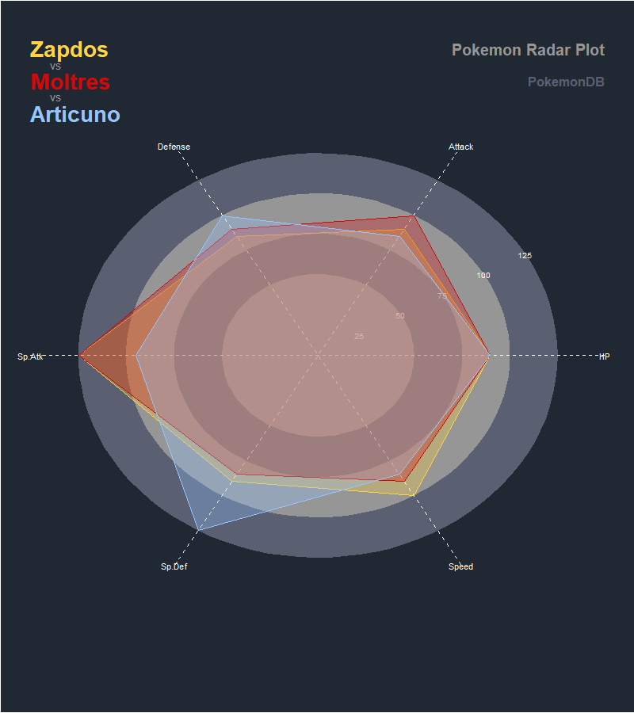

# pokemon-radar-plot
radar plots to compare pokemon stats

# Motivation
I was going browsing through twitter #ggplot2 feed and came across a post by [FC_rstats](https://twitter.com/FC_rstats) about football/soccer player stats and although I don't like sports I really like the visualisation and decided to use it for something I think everyone likes..Pokemon.
# Example

# Libraries and Resources Used
 - [ggplot2](http://ggplot2.tidyverse.org/)
 - [Pokemondb Pokedex](https://pokemondb.net/pokedex/national)
 - [Pokepalettes](http://pokepalettes.com/)

# Future Ideas
I think it would be awesome to have a shiny app that allows you to select the pokemon you want to compare so you can have a wide variety of plots instead of the ones I have selected here
 
# Credits
I wouldn't have been able to create this without the great work of [FCrSTATS github](https://github.com/FCrSTATS/Visualisations/blob/master/2.BuildingARadar.md) explaining how everything works and providing such a great resource.